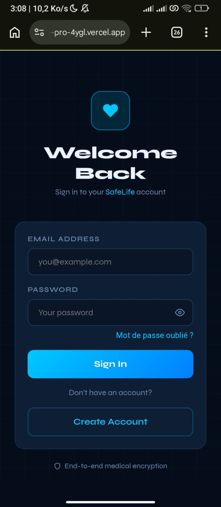
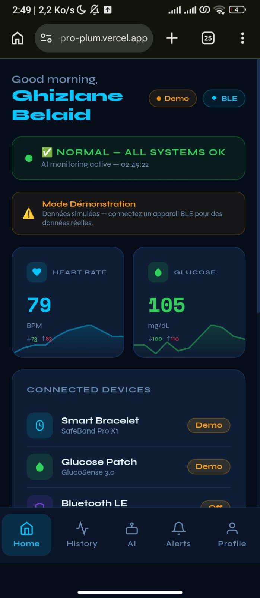
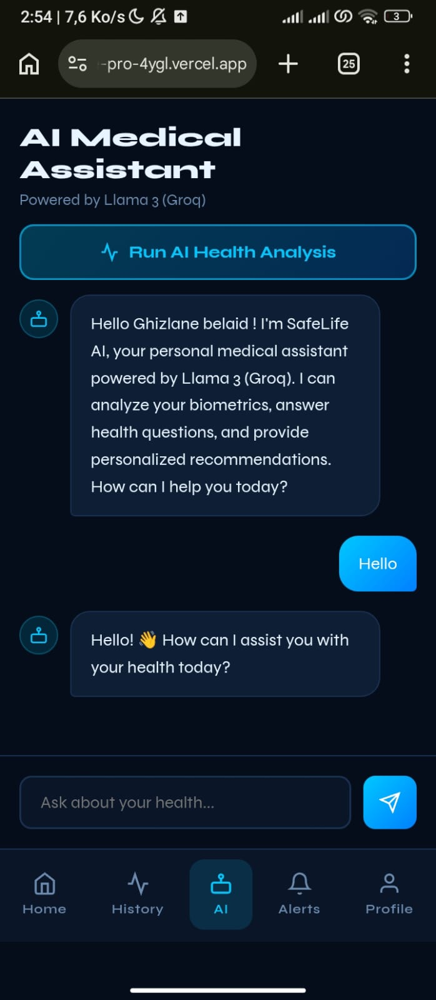
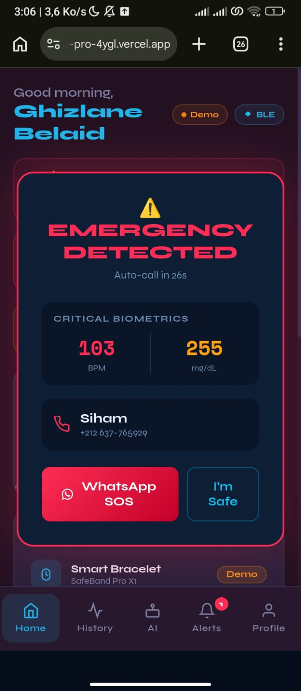
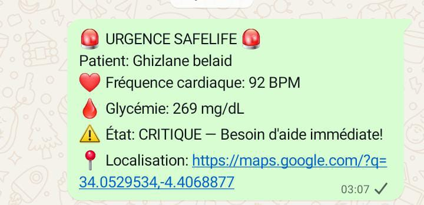
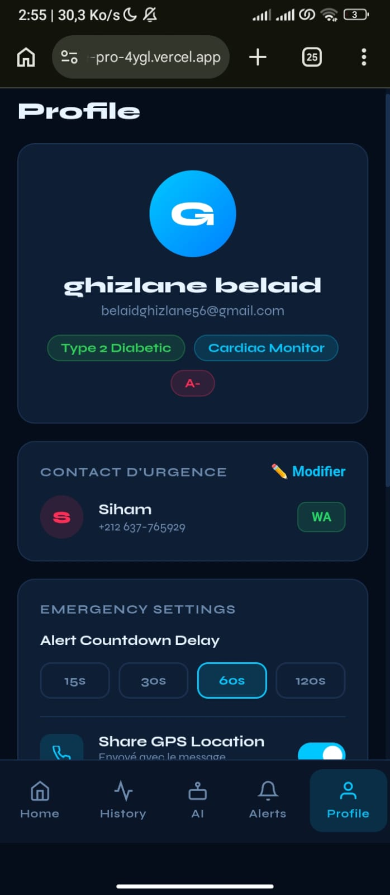
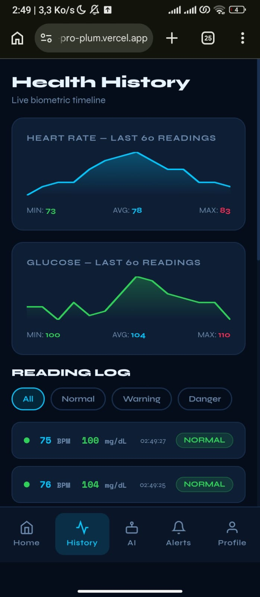

# 💚 SafeLife Pro

> Real-time medical monitoring app for diabetic and cardiac patients, powered by Firebase + Groq (Llama-class open models).

**Live demo:** https://safelife-pro-4ygl.vercel.app/

## 🩺 The Project

SafeLife Pro was born during the **MIATHON 2026** hackathon, in response to a real public health problem in Morocco:

- **2.7 million Moroccans** live with diabetes, roughly 50% of them undiagnosed.
- **38% of deaths** in Morocco are caused by cardiovascular disease — the country's leading cause of mortality.
- Existing solutions (Apple Watch, FreeStyle Libre) cost between 700 and 7,000 DH, out of reach for most Moroccan households.

**Problem statement:** how do you prevent a serious — potentially fatal — accident when someone suddenly loses consciousness (diabetes, cardiac arrest, fainting), whether they're alone at home, on the street, or driving, with no one around to raise the alarm in time?

### The solution: a three-layer system

| Layer | Role |
|---|---|
| 🩹 **Glucose patch** | Continuous glucose monitoring, up to 14 days of battery life, real-time BLE transmission |
| ⌚ **Connected wristband** | Heart rate, blood oxygen (SpO2), built-in GPS, vibration alerts |
| 📱 **Mobile app (this repo)** | Receives device data, analyzes it via AI, triggers alerts to family/doctor/emergency services |

**This repository contains the application layer**: it connects to devices over Bluetooth Low Energy (BLE), stores history in Firebase, and uses an AI model (Groq) for analysis and predictive alerts. The patch and wristband are the project's physical hardware (hackathon prototype, ~700 DH), not included in this software repo.

---

## 📡 Device Connectivity (Bluetooth BLE)

The app connects to sensors (wristband, patch) via the [Web Bluetooth API](https://developer.mozilla.org/en-US/docs/Web/API/Web_Bluetooth_API), directly from the browser, with no native app required.

- Menu → **Bluetooth Devices** → **Connect Device** opens the browser's native device picker.
- Supported GATT services: `heart_rate`, `glucose`, `battery_service`, `device_information`.
- Once connected, real sensor data replaces the simulated values shown by default.

**Browser support:** Chrome, Edge, and Opera only (desktop/Android) — Web Bluetooth is not supported in Safari or Firefox (a browser limitation, not an app bug).

> No physical device is required to try the app: the dashboard shows realistic simulated biometrics by default, so every feature (including the AI assistant) can be tested without hardware.
## ✨ Features

### 🔐 Authentication
Firebase Auth — register / login / logout.




### 📊 Live Biometric Dashboard
Heart rate, glucose, SpO2, blood pressure — updated in real time.



### 🤖 AI Medical Assistant
Groq (`openai/gpt-oss-20b`) analyzes your real biometric data and answers health questions.



### 🚨 Emergency SOS
Auto-detects critical values and triggers a countdown alert. Once the countdown ends, the app automatically opens WhatsApp with a pre-filled message containing the patient's vitals and GPS location, sent to the configured emergency contact.





### 👤 Medical Profile
Blood group, diabetes type, medications, emergency contact.



### 📈 Health History
Timeline of past readings saved to Firestore.



---

## 🛠️ Tech stack

**Architecture serverless — pas de backend dédié.** Pas de serveur Express/Django à maintenir : Firebase joue le rôle de backend-as-a-service (auth + base de données), et une fonction serverless Vercel gère le seul besoin de logique côté serveur (cacher la clé API Groq).

| Couche | Technologie | Rôle |
|---|---|---|
| Frontend | React 18 (Create React App) | Interface utilisateur |
| Auth + Database | Firebase Auth + Firestore | Backend-as-a-service — gère comptes, sessions, stockage des données médicales |
| Logique serveur | `api/chat.js` (fonction serverless Vercel) | Seul point où du code tourne côté serveur : proxy sécurisé vers Groq, garde la clé API secrète |
| IA | Groq API (`openai/gpt-oss-20b`) | Analyse des biométriques, assistant conversationnel |
| Hébergement | Vercel | Build statique + exécution de la fonction serverless |

---

## 🚀 Run it in under 2 minutes

```bash
git clone https://github.com/ghizlanebelaid23-coder/-safelife-pro.git
cd -safelife-pro
npm install
cp .env.example .env    # then fill in the values, see below
npm start                # http://localhost:3000
```

Note: `npm start` only runs the React frontend. The `/api/chat` route is a Vercel serverless function and won't respond locally under plain `npm start` — use `vercel dev` instead, or just deploy (below).

### Getting your keys

| Variable | Where to get it |
|---|---|
| `REACT_APP_FIREBASE_*` | [Firebase console](https://console.firebase.google.com) → Project settings → your web app config |
| `GROQ_API_KEY` | [console.groq.com/keys](https://console.groq.com/keys) — free tier, no credit card. **Must start with `gsk_`.** |

`GROQ_API_KEY` is **not** prefixed with `REACT_APP_` on purpose — that prefix tells Create React App to bundle a value into the public JS. This key is only read server-side (`api/chat.js`), so it must stay unprefixed and secret.

---

## ☁️ Deploy to Vercel

1. Push this repo to your own GitHub account.
2. On [vercel.com](https://vercel.com) → **Add New → Project** → import the repo.
3. Before deploying, add every variable from `.env.example` under **Environment Variables**.
4. Deploy. Any future `git push` to `main` redeploys automatically.

---

## ⚠️ Known limitations (free-tier services)

- **Groq rate limits.** The free tier caps requests per minute/day (~30 requests/minute). Rapid bursts return an HTTP `429`; the app shows a clear message and it resolves itself within a minute. Normal usage never comes close to this limit.
- **Groq's model catalog changes.** Groq periodically deprecates older models. If the AI assistant fails with a "model decommissioned" error, check [console.groq.com/docs/models](https://console.groq.com/docs/models) and update the `model` field in `src/App.jsx`.
- **Firebase and Vercel free tiers don't expire**, but do have usage quotas. A portfolio-scale demo won't come close to hitting them.

---

## 📁 Project structure
-safelife-pro/
├── api/
│ └── chat.js ← serverless proxy to Groq (keeps the API key server-side)
├── public/
│ └── index.html
├── src/
│ ├── App.jsx 
│ ├── firebase.js
│ └── index.js 
├── screenshots/
├── .env.example
├── .gitignore
├── LICENSE
├── package.json
├── package-lock.json
└── README.md
## 🏆 Origin

Built as a team project during the **Miathon** hackathon. 

## 📄 License

This project is licensed under the [MIT License](LICENSE).
